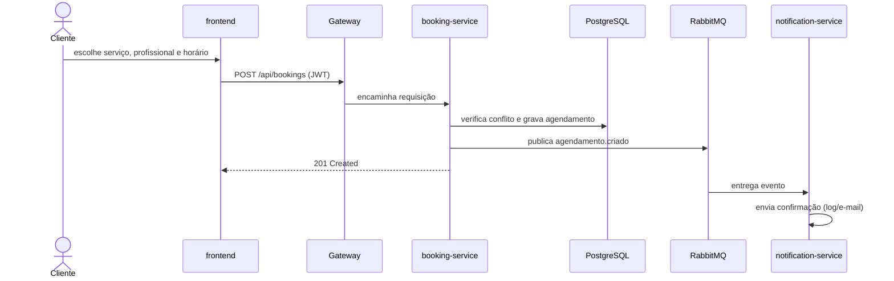

# Arquitetura detalhada

> Em construção: ambiente, componentes, diagramas de sequência e decisões técnicas.

## Diagrama de sequência: criação de agendamento

```mermaid
sequenceDiagram
    actor C as Cliente
    participant FE as frontend
    participant GW as Gateway
    participant B as booking-service
    participant DB as PostgreSQL
    participant MQ as RabbitMQ
    participant N as notification-service

    C->>FE: escolhe serviço, profissional e horário
    FE->>GW: POST /api/bookings (JWT)
    GW->>B: encaminha requisição
    B->>DB: verifica conflito e grava agendamento
    B->>MQ: publica agendamento.criado
    B-->>FE: 201 Created
    MQ->>N: entrega evento
    N->>N: envia confirmação (log/e-mail)
```
